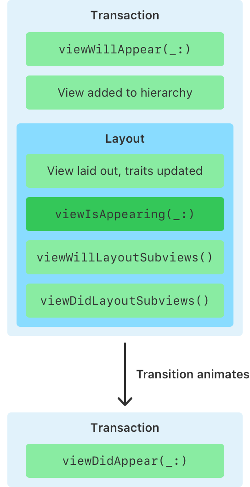

# viewIsAppearing

原文: https://developer.apple.com/documentation/uikit/uiviewcontroller/4195485-viewisappearing

## 詳解

- `viewWillAppear(_:)`呼び出しの後、ViewControllerのViewが表示されるたびに1回呼び出される
- ViewControllerのViewをViewの階層に追加した後に呼び出される
- 更新後の`traitCollection`と正確なViewの配置情報を持っている
- overrideしてViewの表示に関連する処理を実行する(`traitCollection`に基づく更新、ScrollViewのポジションに関わる処理など)

## 適切なメソッドの選択(viewWillAppear or viewIsAppearing)

- どちらも同じ[`CATransaction`](https://developer.apple.com/documentation/quartzcore/catransaction)の中で呼ばれる。つまりどちらのメソッドで行った変更もユーザーからは同時行われているように見える

- `viewWillAppear(_:)`が使われる箇所は限定的
  - viewの遷移が始まる前に処理が必要な場合
    -  transitionCoordinatorにアクセスしてAlongside animations(ViewControllerの遷移アニメーションと同時に実行されるようにフレームワークに指示するアニメーション)を実行したい場合。
    -  Viewのtraitや階層、配置に依存しない処理で、viewIsAppearingの処理とバランスを取りたい場合(データベースからの通知の登録など)
- その他はviewIsAppearing

| メソッドが呼び出された時の状態                           | viewWillAppear | viewIsAppearing |
|-----------------------------------------------------|--------------|------------|
| Alongside animationsを追加するためにtransitionCoordinatorが利用可能                    | ⭕️     | ❌ |
| Viewが階層に追加された                         | ❌       | ⭕️ |
| ViewControllerとViewの`traitCollection`が更新された                         | ❌       | ⭕️ |
| Viewの配置(sizeやsafe areaなど)が正しい                         | ❌       | ⭕️ |

- Viewが`layoutSubviews()`を実行するたびに、`viewWillLayoutSubviews()`や`viewDidLayoutSubviews()`などのレイアウトメソッドを呼び出すが、これは遷移中に複数回発生したり、Viewがvisibleな間はいつでも起きる可能性がある
- しかし、`viewIsAppearing(_:)`は外観遷移中に一度だけ呼び出され、Viewが表示されたときにレイアウトする必要がない場合でも呼び出される
